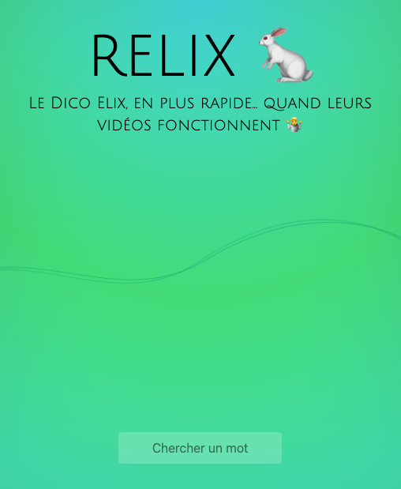

# RELIX 🐇

#### Le [Dico Elix](https://dico.elix-lsf.fr/), en plus rapide

> Le Dico Elix est un moteur de recherche public permettant de trouver des vidéos de signes de la Langue des Signes
> Française.

Recherchez dans le dictionnaire Elix plus rapidement !

- La recherche s'effectue lorsque vous finissez de taper votre mot
- La vidéo du premier résultat est jouée automatiquement et tourne en boucle

Notez que... j'accède à l'API d'Elix grâce à une clé disponible en clair en utilisant leur add-on pour Firefox. 🙃

J'ai tenté de contacter le dev dédié à Elix, en vain.

